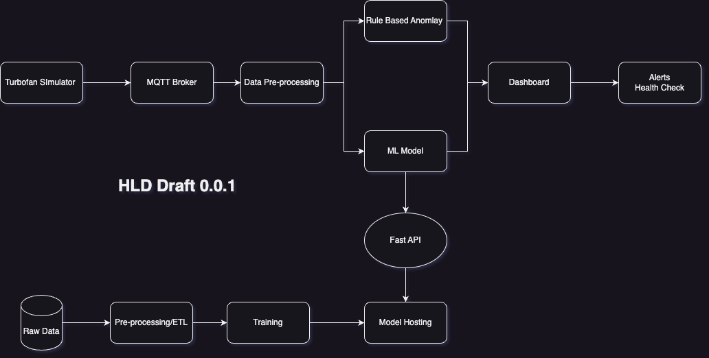

# Turbofan IoT Anomaly Detection MVP

> **An end-to-end IoT MVP for real-time anomaly detection in NASA Turbofan engine telemetry.**  
Includes data ingestion (MQTT/Kafka), stream processing, ML-based anomaly scoring, alerting, and a React dashboard for visualization.

---

## 🚀 Overview
This project demonstrates an IoT-based predictive maintenance pipeline using the **NASA CMAPSS Turbofan Engine dataset**. It simulates engine telemetry, detects anomalies in real time, and provides a dashboard for monitoring health and alerts.

---

## ✅ Features
- **IoT Data Simulation**: Publish turbofan telemetry via MQTT.
- **Streaming Pipeline**: Ingest data using MQTT → Kafka → Stream Processor.
- **Anomaly Detection**:
  - Rule-based (z-score thresholds).
  - ML-based (Autoencoder/LSTM trained on CMAPSS).
- **Model Serving**: FastAPI REST + WebSocket endpoints.
- **Visualization**: React dashboard with live charts, anomaly events, and health score.
- **Alerting**: Email/SMS/Slack integration for anomaly notifications.
- **Observability**: Prometheus + Grafana for system metrics.

---

## 🏗 Architecture

**Hot Path**:  
Simulator → MQTT → Kafka → Stream Processing → Features → Model → Alerts → Redis → React Dashboard

**Cold Path**:  
Kafka → Data Lake → ETL → Feature Store → Offline Training → Model Registry → Serving

---

## 📂 Repository Structure
