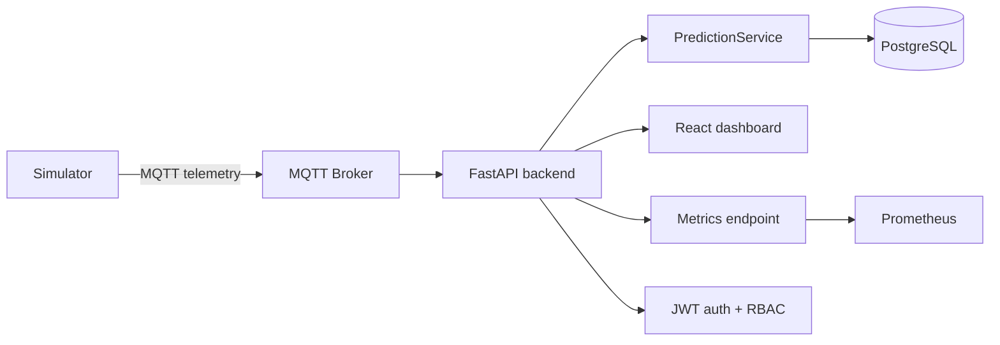

# Turbofan IoT Anomaly Detection MVP

This repository implements a local predictive maintenance stack for turbofan engine telemetry. The application combines a FastAPI backend, PostgreSQL storage, MQTT-based live simulation, a React dashboard, and ML inference artifacts to provide a working anomaly-detection demo and operational dashboard.

The codebase is the source of truth for the runtime behavior. This README reflects the actual services, configuration, and files in the repository rather than a generic architecture checklist.

---

## 1. What this project does

The project ingests simulated turbofan telemetry, scores each engine event with a trained anomaly detection model, stores predictions and alerts, and exposes a dashboard for live and historical monitoring.

Core behavior in this repo:

- simulate multiple engine profiles with different degradation behavior,
- publish telemetry over MQTT,
- run inference through the backend prediction service,
- persist predictions and alerts to PostgreSQL,
- surface fleet, engine, alert, and overview metrics via JWT-protected API routes,
- render the live monitoring UI in a React app,
- expose Prometheus-compatible metrics for operational monitoring.

---

## 2. System architecture



### Runtime components

| Component | Role | Entry point |
| --- | --- | --- |
| PostgreSQL | Stores users, predictions, and alerts | docker-compose.local.yml |
| Alembic migration job | Applies DB schema upgrades | docker-compose.local.yml + alembic/ |
| FastAPI backend | API, auth, model orchestration, dashboard data | backend/app.py |
| Live simulator | Emits per-engine telemetry and persists predictions | backend/services/simulator_service.py |
| React dashboard | Fleet UI and monitoring screens | dasboard/src/ |
| MQTT broker | Real-time telemetry transport | docker-compose.local.yml |
| Prometheus | Scrapes backend metrics | monitoring/prometheus.yml |
| ML artifacts | Trained model, scaler, metrics | artifacts/ |

---

## 3. Repository layout

```text
.
├── alembic/                    # DB migration scripts
├── artifacts/                 # trained model artifacts and metrics
├── backend/
│   ├── app.py                 # FastAPI app entry point
│   ├── config.py              # environment settings
│   ├── database.py            # SQLAlchemy session setup
│   ├── dependencies.py        # auth dependencies
│   ├── logging_config.py      # structured logging
│   ├── models/                # SQLAlchemy tables
│   ├── repositories/          # data access layer
│   ├── routes/                # route package (extension point)
│   ├── schemas/               # request/response models
│   ├── security/              # JWT and password helpers
│   ├── services/              # inference, simulator, bootstrap, metrics
│   └── requirements.txt
├── data/                      # processed telemetry input data
├── docs/
│   ├── api_collection/        # Postman export
│   ├── hld/                  # architecture documentation
│   └── ml/                   # ML documentation and model notes
├── evaluation/                # model comparison and evaluation scripts
├── logs/                      # runtime logs and collected compose logs
├── monitoring/                # Prometheus config
├── notebooks/                 # exploratory notebooks
├── reports/                   # model comparison outputs
├── scripts/                   # operational scripts
├── simulator/                 # telemetry publisher service
├── training/                  # model training scripts
├── .env.example               # local environment defaults
├── alembic.ini                # Alembic config
├── docker-compose.local.yml   # local dev stack definition
├── README.md                  # project guide
└── LICENSE
```

---

## 4. Local startup

### Prerequisites

- Docker Desktop or Docker Engine with Compose
- Node.js 18+ for dashboard development work
- Python 3.11+ for backend-only local runs

### 1) Configure environment

Copy the sample environment file if needed:

```bash
cp .env.example .env
```

The sample file defines the local defaults used by the compose stack, including:

- PostgreSQL credentials
- API and JWT settings
- admin bootstrap credentials
- dashboard port and MQTT settings

### 2) Start the full stack

```bash
docker compose -f docker-compose.local.yml up --build -d
```

This starts the local stack:

- postgres
- db-migrate
- backend-api
- dashboard
- mqtt-broker
- simulator
- optional test profile

To follow logs:

```bash
docker compose -f docker-compose.local.yml logs -f backend-api dashboard simulator postgres
```

### 3) Check health

The API exposes a basic health endpoint:

```bash
curl http://localhost:8000/health
```

The dashboard is served at:

```text
http://localhost:3000
```

The default bootstrap admin user is defined in `.env.example`:

```text
Email: admin@turbofan.local
Password: admin123!
```

---

## 5. Core API surface

The API is implemented in `backend/app.py`. It serves both the ML inference path and the dashboard data path.

### Authentication

- `POST /auth/login`
- `GET /auth/me`
- `POST /auth/users`

### Model and inference

- `GET /model-info`
- `POST /predict`
- `POST /batch-predict`
- `POST /predict-batch`

### Dashboard data

- `GET /api/recent-anomalies`
- `GET /api/engines`
- `GET /api/engine/{engine_id}`
- `GET /api/metrics/overview`
- `GET /api/metrics/trends`
- `GET /api/alerts`

### Simulator control

- `GET /api/simulator/status`
- `POST /api/simulator/start`
- `POST /api/simulator/stop`
- `POST /api/simulator/run-once`

### Operational endpoints

- `GET /health`
- `GET /metrics`

These API routes are protected by JWT/auth dependencies and role checks in `backend/dependencies.py`.

---

## 6. Data flow and persistence

The actual runtime path is:

1. the simulator produces telemetry frames,
2. the frame is published to MQTT,
3. the backend `PredictionService` scores the features,
4. a prediction record is written to PostgreSQL,
5. anomaly alerts are inserted when the result qualifies,
6. the dashboard reads the same PostgreSQL data via repository queries.

### Database schema

The models live in `backend/models/db_models.py`:

- `users`
  - `id`, `email`, `password_hash`, `role`, `is_active`, `created_at`
- `predictions`
  - `id`, `event_id`, `engine_id`, `event_timestamp`, `anomaly_score`, `is_anomaly`, `model_name`, `model_version`, `payload_metadata`, `created_at`
- `alerts`
  - `id`, `event_id`, `prediction_id`, `engine_id`, `severity`, `message`, `created_at`

Persistent storage is handled through `backend/repositories/prediction_repository.py`.

---

## 7. ML model and artifacts

The project uses trained artifacts stored under `artifacts/`.

Current implementation:

- `artifacts/isolation_forest/model.joblib`
- `artifacts/isolation_forest/scaler.joblib`
- `artifacts/isolation_forest/metrics.json`
- `artifacts/autoencoder/` for the secondary model path

The prediction path is defined in `backend/services/prediction_service.py` and loads the trained Isolation Forest model at startup.

### ML documentation

- `docs/ml/README.md`
- `docs/ml/modeling-notes.md`
- `training/`
- `evaluation/`
- `reports/`

This directory is intentionally separated from the runtime and dashboard docs.

---

## 8. Simulator behavior

The live simulator is implemented in `backend/services/simulator_service.py`.

It creates engine-specific profiles with different degradation and sensor drift behavior. Each engine gets a distinct profile and therefore different telemetry trajectories rather than identical values across the fleet.

The simulator exposes:

- per-engine state tracking,
- metadata including profile and cycle,
- MQTT publishing,
- persistence of prediction records,
- alert creation for anomalous events,
- configurable engine count and interval.

Typical environment values are defined in `.env.example`:

```env
SIM_ENGINES=4
SIM_INTERVAL=0.5
SIM_BATCH_MODE=false
SIM_DEBUG=false
```

---

## 9. Dashboard

The UI is a Vite + React application under `dasboard/`.

Important notes:

- it depends on the backend API for live data,
- it fetches protected dashboard endpoints using JWT-based auth,
- it should not use hardcoded values when live records are available,
- values are displayed to two decimal places in the UI for readability.

The dashboard should be treated as a thin client on top of the backend; the authoritative state comes from the database and the simulator-generated events.

---

## 10. Observability and debugging

### Metrics

The backend exposes Prometheus-formatted metrics at `GET /metrics`.

The scraper configuration is in `monitoring/prometheus.yml` and targets:

```yaml
- job_name: turbofan-backend
  metrics_path: /metrics
  static_configs:
    - targets:
        - backend-api:8000
```

### Logs

Structured JSON logs are generated through `backend/logging_config.py` and stored under `logs/`.

To capture a full set of container logs into the repo:

```bash
bash scripts/collect_docker_logs.sh
```

This writes logs under:

- `logs/docker/`

### Useful operational checks

```bash
docker compose -f docker-compose.local.yml ps
docker compose -f docker-compose.local.yml logs -f backend-api
curl http://localhost:8000/api/metrics/overview
curl http://localhost:8000/api/recent-anomalies?limit=20
```

---

## 11. Development workflows

### Backend-only local run

```bash
python -m venv .venv
source .venv/bin/activate
pip install -r backend/requirements.txt
alembic upgrade head
uvicorn backend.app:app --host 0.0.0.0 --port 8000 --reload
```

### Dashboard-only local run

```bash
cd dasboard
npm install
npm run dev
```

### Run tests inside the compose profile

```bash
docker compose -f docker-compose.local.yml --profile test up --build test
```

This uses the `test` service and runs `pytest -q`.

---

## 12. Extending the system

This repo is not a framework-driven agent platform with a formal MCP or tool registry embedded in the codebase. The extension points are the actual application services that already exist:

- add new endpoints in `backend/app.py`,
- add business logic to repository/service modules,
- train new models under `training/` and `evaluation/`,
- store new artifacts in `artifacts/`,
- add new simulator behaviors in `backend/services/simulator_service.py`,
- expose new dashboard widgets or pages in `dasboard/src/`.

If you are adding new ML capabilities, prefer the current pattern:

1. train and evaluate the model,
2. save artifacts and metrics,
3. load the model in `PredictionService`,
4. expose new result fields through the backend API,
5. visualize the new data in the dashboard.

---

## 13. Deployment guidance

This project is currently designed as a local development and demonstration deployment, not a hardened production deployment. The compose file is a minimal working environment for testing and local orchestration.

Recommended production-hardening steps before moving beyond the MVP:

- externalize secrets and JWT configuration,
- add environment-specific settings management,
- move telemetry ingress behind a managed broker or event platform,
- add CI/CD and smoke tests,
- configure persistent storage and backup strategy,
- enforce stricter security and rate limiting,
- add autoscaling and monitoring for the backend and simulator workloads.

---

## 14. Troubleshooting checklist

If the stack fails to start:

1. confirm Docker is running,
2. confirm `POSTGRES_*` and `DATABASE_URL` values are consistent,
3. run `docker compose -f docker-compose.local.yml config`,
4. verify the database migration job completes successfully,
5. check backend and simulator logs,
6. confirm the MQTT broker is healthy before the simulator starts,
7. validate the JWT secret and bootstrap credentials match the expected local values.

---

## 15. References

- `docker-compose.local.yml`
- `backend/app.py`
- `backend/services/simulator_service.py`
- `backend/services/prediction_service.py`
- `backend/repositories/prediction_repository.py`
- `backend/models/db_models.py`
- `monitoring/prometheus.yml`
- `docs/hld/`
- `docs/ml/`
- `.env.example`

This project is intentionally simple and operationally transparent: the backend owns inference and persistence, the simulator emits live engine telemetry, and the dashboard consumes the same data source that drives the running system.
