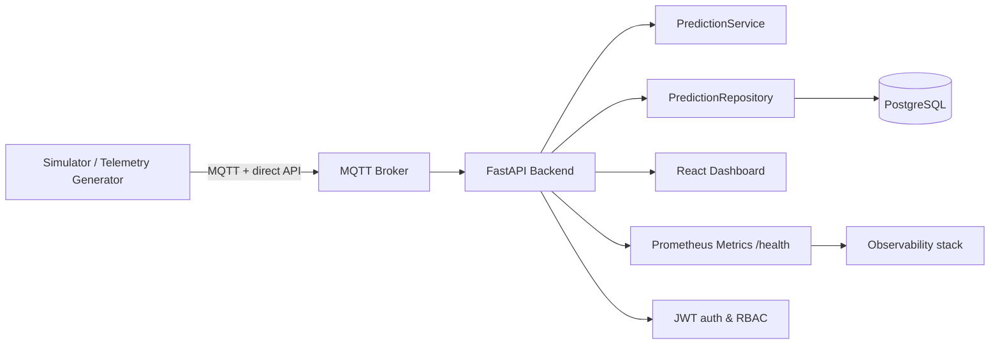
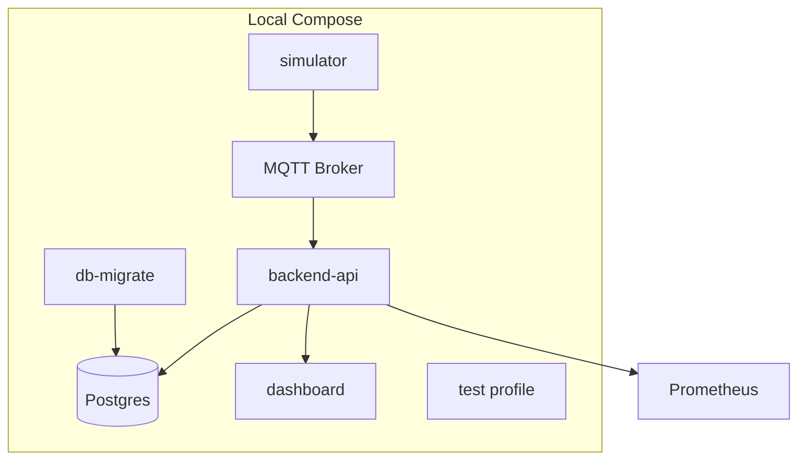

# Turbofan MVP Architecture and Scalability Review

## Executive Summary

This repository demonstrates a compact predictive maintenance platform built around a FastAPI backend, PostgreSQL persistence, MQTT-based live telemetry, and a React dashboard. The system is functionally coherent and operationally viable for local demos and small-scale validation, but it is not yet a production-grade distributed platform.

The current architecture is best described as a tightly coupled monolithic service with a worker-like simulator and a lightweight observability layer. The application can support a small number of engines and low concurrency, but several design constraints appear as the workload scales: synchronous database writes, non-distributed process topology, hard-coded assumptions around thread/process execution, limited queueing or backpressure controls, and auth/config patterns that are acceptable for local dev but not robust for production operations.

The platform has a good foundation for growth because the core responsibilities are already separated at the component level:

- telemetry generation and modeling are isolated,
- persistence is centralized through a repository layer,
- API routes are grouped by concern,
- metrics and health endpoints are in place,
- deployment is containerized and reproducible.

The most important gaps before production are operational reliability, concurrency safety, and stronger architecture boundaries for ingestion, processing, and storage.

## Current Architecture

The system currently uses a local Docker Compose stack defined in [docker-compose.local.yml](../../docker-compose.local.yml) and a Python-based backend centered on [backend/app.py](../../backend/app.py). The backend performs the following roles:

- hosts the FastAPI API,
- authenticates users with JWT,
- loads the trained anomaly model,
- persists predictions and alerts to PostgreSQL,
- exposes dashboard data and metrics,
- starts and controls a telemetry simulator as part of app state.

The simulator service is implemented in [backend/services/simulator_service.py](../../backend/services/simulator_service.py) and produces per-engine telemetry with different degradation profiles. The model logic is implemented in [backend/services/prediction_service.py](../../backend/services/prediction_service.py), and the persistence layer is handled by [backend/repositories/prediction_repository.py](../../backend/repositories/prediction_repository.py).

The data model is compact but operationally useful:

- `users` stores identity and role metadata,
- `predictions` stores event payloads and anomaly scores,
- `alerts` stores derived operational events.

This schema is declared in [backend/models/db_models.py](../../backend/models/db_models.py).

### Architecture view



### Runtime topology



---

## Component Analysis

### 1. API entry point and runtime composition

The central application lifecycle is defined in [backend/app.py](../../backend/app.py).

Key functions and responsibilities:

- `lifespan()` — boots the app by creating the admin user and instantiating the simulator.
- `login()` — authenticates a user and emits a JWT.
- `predict()` / `predict_batch()` — run inference and persist prediction records.
- `recent_anomalies()` / `engines()` / `engine_details()` / `alerts()` / `metrics_overview()` — support dashboard data queries.
- `simulator_status()` / `start_simulator()` / `stop_simulator()` / `run_simulator_once()` — control the live telemetry loop.
- `metrics()` — exposes a Prometheus-compatible output string.

This file provides a pragmatic monolithic API that is easy to run and debug, but it mixes concerns: auth, business logic, persistence, simulator control, and admin bootstrap all sit in the same service layer.

### 2. Prediction service

The model logic lives in [backend/services/prediction_service.py](../../backend/services/prediction_service.py).

The `PredictionService` class:

- loads the trained Isolation Forest artifact and scaler,
- reads feature columns and threshold from `metrics.json`,
- builds a feature matrix,
- transforms inputs with the scaler,
- scores the input using `score_samples()`.

This is a clean, minimal inference boundary. It is a good fit for a single model service and easy to replace or extend with another model strategy.

### 3. Persistence and repositories

The repository layer is implemented in [backend/repositories/prediction_repository.py](../../backend/repositories/prediction_repository.py).

Important functions:

- `add_prediction()`
- `add_alert()`
- `recent_anomalies()`
- `engines()`
- `engine_details()`
- `overview_metrics()`
- `alerts()`

These methods centralize database interaction and provide the dashboard with aggregated views. The repository pattern is appropriate for this MVP but the operations are currently more transaction-oriented than stream-oriented. This is acceptable for a demo system but less robust for high-cardinality telemetry ingestion.

### 4. Database model and schema constraints

The schema is defined in [backend/models/db_models.py](../../backend/models/db_models.py).

Key models:

- `Prediction`
- `Alert`
- `User`

The design shows basic integrity controls and indexing on common lookup fields. It is a good baseline, but the database is being used as both a command store and an analytics store. That is fine for small scale, but it creates pressure on query and write patterns as data volume grows.

### 5. Simulator design

The live data source is [backend/services/simulator_service.py](../../backend/services/simulator_service.py).

Key structures and methods:

- `SimulationConfig`
- `LiveTelemetrySimulator.__init__()`
- `_init_engine_state()`
- `build_telemetry_frame()`
- `_persist_prediction()`
- `_emit_loop()`
- `publish()`
- `start()` / `stop()` / `status()` / `run_once()`

This is a straightforward streaming simulator that writes telemetry and derived predictions into the database. It is useful for local validation and dashboard demo work, but it is also proof that the application currently assumes a relatively controlled traffic pattern and a single process writing into the same backend datastore.

### 6. Observability and metrics

The observability layer is light but useful. Relevant files:

- [monitoring/prometheus.yml](../../monitoring/prometheus.yml)
- [backend/logging_config.py](../../backend/logging_config.py)
- [backend/app.py](../../backend/app.py) `metrics()` and `_render_metrics()`
- [scripts/collect_docker_logs.sh](../../scripts/collect_docker_logs.sh)

This provides:

- Prometheus scrape targets,
- rotating JSON-based logs,
- simple counters and gauges,
- container log capture helpers.

This is enough for local debugging and basic SRE oversight, but it does not yet provide modern production observability such as distributed tracing, long-term metrics retention, SLO tracking, or structured ingestion-quality monitoring.

### 7. Security posture

The authentication and authorization implementation is in:

- [backend/security/auth.py](../../backend/security/auth.py)
- [backend/dependencies.py](../../backend/dependencies.py)
- [backend/services/bootstrap.py](../../backend/services/bootstrap.py)
- [backend/config.py](../../backend/config.py)

Observations:

- JWT-based auth is present and role checks are enforced.
- Passwords are hashed with bcrypt via Passlib.
- Bootstrapped admin credentials exist for local dev.
- CORS is configured permissively (`allow_origins=["*"]` in [backend/app.py](../../backend/app.py)).

For local testing this is reasonable, but for production it is insufficiently restrictive and should be tightened with explicit allowlists, environment isolation, and stronger secret rotation procedures.

---

## Scalability Assessment

### Overall scalability posture

The system scores as a small-scale demonstrator or internal pilot platform, not a high-throughput industrial telemetry system.

The main strength is that the code is not overengineered. It is easy to run, reason about, and debug locally. That makes it ideal for a controlled lab environment or proof-of-concept.

The main weakness is the topology: ingestion, modeling, and persistence are all operating within one service boundary and one database. This creates a clear throughput ceiling and a risk of operational coupling.

### Scalability dimensions

#### 1. Horizontal scale

The service can be containerized and replicated, but the code is not designed for multi-instance state coordination. Notably, the simulator is stored as an in-process object on app state, and the lifecycle is attached to a single FastAPI process. That means state, timers, and runtime behavior are not safely shared across replicas. See [backend/app.py](../../backend/app.py) and [backend/services/simulator_service.py](../../backend/services/simulator_service.py).

#### 2. Data throughput

The repository writes each prediction synchronously to the database and commits on each insert. This is simple and correct, but it becomes a bottleneck at high write rates. See [backend/repositories/prediction_repository.py](../../backend/repositories/prediction_repository.py).

#### 3. Query performance

The dashboard reads operational summaries and recent anomalies directly from the same database. This is manageable for a limited engine fleet, but cardinality will rise quickly if telemetry volumes or engine counts increase. `overview_metrics()` and `engines()` are aggregated queries that will become more expensive as the dataset grows. See [backend/repositories/prediction_repository.py](../../backend/repositories/prediction_repository.py).

#### 4. Event fan-out

The current system does not appear to implement durable queueing or asynchronous worker separation for ingestion events beyond the optional Kafka path. The backend effectively directly serves requests and persists them in a synchronous database transaction. This is not ideal for bursty or high-volume telemetry streams.

#### 5. Model serving scale

The current model loader is instantiated at app startup and used synchronously by each request. That is good for simplicity, but the architecture does not yet include model sharding, autoscaling, or asynchronous prediction worker pools. See [backend/services/prediction_service.py](../../backend/services/prediction_service.py) and [backend/app.py](../../backend/app.py).

---

## Bottleneck Analysis

### Primary bottleneck: synchronous DB writes during prediction flow

The critical path from request to persistence is:

1. incoming payload accepted by `predict()` in [backend/app.py](../../backend/app.py),
2. model inference is performed in `PredictionService.predict()`,
3. `_persist_prediction()` creates a DB session,
4. `PredictionRepository.add_prediction()` executes an insert and commits.

This is a synchronous write path. At moderate scale, the API latency is directly correlated to database I/O and session overhead. This is the first major quality problem if the service is used for a real-time fleet with hundreds or thousands of engine streams.

### Secondary bottleneck: simulator and API share the same process state

The simulator is created in app lifespan and stored as an app singleton. See [backend/app.py](../../backend/app.py) and [backend/services/simulator_service.py](../../backend/services/simulator_service.py).

This means:

- thread lifecycle is tied to one process,
- simulator state is not horizontally scalable,
- fine-grained concurrency with multiple API instances would duplicate or conflict with simulation state,
- the app becomes harder to operate when multi-instance deployment is introduced.

### Tertiary bottleneck: audit and dashboard queries are piggybacking on transactional tables

The dashboard requires recent anomalies, fleet metrics, and per-engine histories from the same tables used for write operations. As volume grows, there will be contention between ingestion, summary generation, and reporting queries. In a production context, these should be separated into a hot path and a reporting path.

### Fourth bottleneck: absence of backpressure or queueing for burst traffic

If the telemetry source emits bursts faster than the model or database can process them, the system currently has no clear mechanism for buffering, retry policy escalation, throttling, or queue-based isolation. The optional Kafka consumer exists, but it is not the primary path and is not yet integrated as a system-wide ingestion standard. See [backend/services/inference_service.py](../../backend/services/inference_service.py).

---

## Async Execution Review

### Current async posture

The application is primarily synchronous in the request path. FastAPI provides async endpoints by default, but most operational logic is regular Python code and direct DB access. The app includes a background simulation loop using `threading.Thread` in [backend/services/simulator_service.py](../../backend/services/simulator_service.py).

This design is valid for a local MVP but creates the following concerns:

- no async scheduling policy,
- background thread complexity is not isolated from the API process,
- no concurrency-safe queue abstraction,
- no explicit worker pool for model scoring,
- no backpressure strategy when telemetry bursts arrive.

### Threading analysis

The simulator loop uses:

```python
self._thread = threading.Thread(target=self._emit_loop, daemon=True)
```

This is simple and effective for demo scenarios, but it is not the same as a production task scheduler or an event-driven worker. Fault isolation is weak because the same process owns API traffic, simulator logic, and database writes.

### Retry logic review

The repo includes `run_with_retry()` in [backend/utils/retry.py](../../backend/utils/retry.py). This is useful for transient errors and improves resilience. However, retries alone are not a substitute for message durability, queue segmentation, or worker scaling. In a real multi-tenant telemetry system, they should sit behind a broker or queue based architecture with retries at the event boundary.

### Recommendation

The architecture should move to one of these patterns:

1. event-driven ingestion with Kafka or a managed broker,
2. a dedicated worker pool for scoring and persistence,
3. an async queue with bounded buffer and rate limits,
4. separate hot-path and reporting stores.

---

## Security Findings

### 1. Permissive CORS policy

In [backend/app.py](../../backend/app.py):

```python
app.add_middleware(
    CORSMiddleware,
    allow_origins=["*"],
    allow_methods=["*"],
    allow_headers=["*"],
)
```

This is acceptable for a local or tightly controlled dev demo, but it is not acceptable for a production deployment that handles real operational data.

### 2. Secret and credential configuration risk

The app reads critical configuration from environment variables in [backend/config.py](../../backend/config.py). The default JWT secret is a development fallback value and should never be accepted in production. The app also bootstraps a default admin account when env values are set. This is convenient for demos but dangerous if exported into production accidentally.

### 3. Sensitive data exposure risk

The application stores telemetry metadata and engine-specific payloads in the `payload_metadata` JSON fields. This is useful for auditability, but unguarded metadata expansion can eventually include sensitive operational details. A production design should classify and filter metadata before persisting it.

### 4. Missing production auth hardening

The current routes use JWTs and role-based checks, which is a solid base. However, they lack stronger protections such as:

- short-lived refresh token strategy,
- explicit rate limiting,
- user session control,
- role usage audits,
- stricter secret lifecycle and rotation controls,
- environment-aware policy switching.

### 5. Simulator security posture

The simulator is configured with anonymous MQTT access in [docker-compose.local.yml](../../docker-compose.local.yml). That is acceptable for a local stack behind a developer network, but not for multi-tenant or Internet-exposed deployments.

---

## Production Readiness Scorecard

| Area | Score | Notes |
| --- | --- | --- |
| Local deployment readiness | 9/10 | Dockerized, simple, reproducible |
| API structure | 7/10 | Clean and understandable but tightly coupled |
| Model serving | 7/10 | Minimal and functional |
| Database design | 7/10 | Adequate for demo; needs stronger scale planning |
| Observability | 6/10 | Metrics and logs exist, but not yet SRE-grade |
| Security | 5/10 | JWT and bcrypt exist, but production hardening is missing |
| Async and concurrency model | 4/10 | Background threads and synchronous DB writes limit scale |
| Operational resilience | 6/10 | Retry logic exists, but queueing and backpressure are missing |
| Fleet scalability | 4/10 | Single-process model and DB coupling are the limiting factors |
| Overall MVP readiness | 6.5/10 | Good for demo/pilot, not yet production-grade |

---

## Architectural Limitations

1. The application is a monolith with a simulator embedded into app state.
2. The application uses synchronous per-request database writes.
3. API, persistence, and simulator processes are effectively not isolated by operational concern.
4. The dashboard relies on a single database used for both hot path and reporting.
5. Observability is local to the app and does not include advanced tracing or data quality monitoring.
6. Security settings are intentionally permissive to support local development.
7. No explicit queueing or ingestion worker separation exists for bursty telemetry.
8. No multi-instance consistency strategy exists for runtime state.
9. Model serving is single-threaded in its current architecture.
10. There is no production deployment topology, only local Docker orchestration.

---

## Risk Register

| Risk | Severity | Likelihood | Why it matters | Primary evidence |
| --- | --- | --- | --- | --- |
| DB saturation under telemetry burst | Critical | High | Write latency and inflight operations increase under load | [backend/repositories/prediction_repository.py](../../backend/repositories/prediction_repository.py) |
| Process coupling between API and simulator | High | High | Multi-instance deployment breaks runtime behavior | [backend/app.py](../../backend/app.py), [backend/services/simulator_service.py](../../backend/services/simulator_service.py) |
| Permissive CORS and local dev defaults | High | Medium | Risky if secrets leak or app is exposed beyond trusted network | [backend/app.py](../../backend/app.py), [backend/config.py](../../backend/config.py) |
| Lack of queueing/backpressure | High | High | Burst ingestion causes uneven service latency or failure | [backend/services/inference_service.py](../../backend/services/inference_service.py) |
| Reporting contention with hot-path writes | High | Medium | Dashboard queries compete with ingestion writes | [backend/repositories/prediction_repository.py](../../backend/repositories/prediction_repository.py) |
| Weak operational metrics modeling | Medium | High | Hard to detect quality regression or SLO breach early | [monitoring/prometheus.yml](../../monitoring/prometheus.yml) |
| Simulation not representative of real fleet patterns | Medium | Medium | Can create false confidence in scale or behavior | [backend/services/simulator_service.py](../../backend/services/simulator_service.py) |
| Auth drift across environments | High | Medium | Local dev settings can accidentally be promoted | [backend/config.py](../../backend/config.py) |
| No distributed tracing | Medium | High | Hard to root-cause latency issues across services | [backend/logging_config.py](../../backend/logging_config.py) |
| Unclear deployment boundaries for production | High | Medium | Current setup is local-only and not production topology | [docker-compose.local.yml](../../docker-compose.local.yml) |

---

## Recommended Improvements

### 1. Decouple ingestors from the application API

Move telemetry intake into a dedicated ingestion path using a broker or durable queue so that API and inference can be separated from data collection pressure. This makes backpressure management possible and reduces single-process skew.

Recommended implementation pattern:

- ingest into Kafka, NATS, or managed Pub/Sub,
- route events to a prediction worker pool,
- persist results asynchronously,
- keep the API endpoint focused on query / orchestration / auth.

### 2. Split hot-path storage from reporting storage

Use the main relational store for operationally critical writes and create a reporting-friendly aggregate layer for dashboards and analytics. Consider materialized views, summary tables, or a warehouse-like layer for trend reporting.

### 3. Replace in-process simulator state with a dedicated service boundary

The simulator should be run as a discrete service, not as an app singleton. That gives the team a clean deployment shape and avoids state-sharing problems across replicas.

### 4. Introduce explicit concurrency and worker limits

Use a bounded worker pool for inference and persistence. Add queue depth limits, retry buckets, and dead-letter handling to avoid runaway work when the system is under stress.

### 5. Tighten security defaults

- restrict CORS,
- enforce exact environment config,
- remove or gate default admin bootstrap in non-dev environments,
- rotate secrets and require separate dev/prod values,
- disallow anonymous MQTT in shared or production networks.

### 6. Add observability beyond app logs

Add:

- distributed tracing,
- trace IDs across the full pipeline,
- request latency SLOs,
- event ingestion quality metrics,
- model drift indicators,
- queue depth and consumer lag dashboards.

### 7. Harden the local model lifecycle

Introduce model versioning, artifact validation, and runtime schema checks so that inference does not silently accept mismatched sensors or missing features. The current model contract is encoded in `feature_columns` and saved metrics, but it should be treated as a formal contract with validation gates.

---

## Scaling Roadmap

### Phase 1: Stabilize the MVP (0–3 months)

- enforce environment-specific config and secret policies,
- reduce CORS and local default exposures,
- isolate simulator process from API process,
- add queueing and explicit retry policy monitoring,
- improve metrics for model, API, and DB latency.

### Phase 2: Vertical decomposition (3–6 months)

- move telemetry ingestion to a durable broker,
- split query and write paths,
- create a dedicated inference worker service,
- add per-engine and fleet-level live metrics,
- introduce model version and release tracking.

### Phase 3: Production-ready platform (6–12 months)

- add autoscaling workers,
- separate operational and analytical data stores,
- implement structured alerting and SRE workflows,
- standardize schema validation and telemetry retention policies,
- adopt end-to-end traces and runbooks for incident response.

---

## Prioritized Action Plan

### Critical (must fix before production)

1. Remove permissive CORS and hard-coded local-dev defaults from production paths.
2. Separate simulator runtime from the API process and ensure there is no state coupling across instances.
3. Introduce a durable ingestion queue and worker pattern for telemetry processing.
4. Add a queue-backed or rate-limited persistence strategy to protect the database from write bursts.
5. Establish environment-specific secret management and production bootstrapping rules.

### High Priority

1. Split hot-path and reporting database usage.
2. Add request and database latency dashboards with SLO thresholds.
3. Introduce model version validation checks and artifact compatibility testing.
4. Create a dead-letter and retry visibility model for ingestion failures.
5. Add tracing IDs and structured error correlation across the ingestion to prediction path.

### Medium Priority

1. Add a stronger telemetry quality monitoring layer.
2. Review and tune indexes and query patterns for engine and anomaly lookups.
3. Add session management and rotation for JWT-based auth.
4. Standardize alert routing and operational escalation for anomaly events.
5. Build a simulated high-load test to validate throughput and latency under pressure.

### Nice to Have

1. Provide autoscaling for prediction workers and API replicas.
2. Add multi-region or multi-tenant deployment readiness.
3. Implement a data retention and archival strategy.
4. Create an engineering dashboard for model drift and fleet health trends.
5. Add advanced anomaly triage workflows and operator runbooks.

---

## Final Assessment

The project is a strong local engineering prototype and an effective demonstration of an anomaly detection pipeline. It demonstrates the right components and a clean end-to-end flow, but it is not yet a production-grade, horizontally scalable, operationally hardened system. The most valuable next step is to break the single-process coupling between application state, telemetry generation, and database persistence so the platform can grow without becoming fragile under concurrent load or production conditions.

The codebase has a sound foundation. The next architecture decisions should be deliberate, incremental, and explicit about separating ingestion, prediction, persistence, and operational analytics.

## Supporting files

- [README.md](../../README.md)
- [docker-compose.local.yml](../../docker-compose.local.yml)
- [backend/app.py](../../backend/app.py)
- [backend/config.py](../../backend/config.py)
- [backend/security/auth.py](../../backend/security/auth.py)
- [backend/dependencies.py](../../backend/dependencies.py)
- [backend/models/db_models.py](../../backend/models/db_models.py)
- [backend/repositories/prediction_repository.py](../../backend/repositories/prediction_repository.py)
- [backend/services/prediction_service.py](../../backend/services/prediction_service.py)
- [backend/services/simulator_service.py](../../backend/services/simulator_service.py)
- [backend/services/inference_service.py](../../backend/services/inference_service.py)
- [backend/logging_config.py](../../backend/logging_config.py)
- [backend/utils/retry.py](../../backend/utils/retry.py)
- [monitoring/prometheus.yml](../../monitoring/prometheus.yml)
- [scripts/collect_docker_logs.sh](../../scripts/collect_docker_logs.sh)
