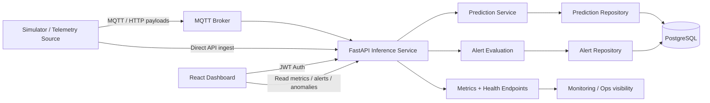

# Turbofan Predictive Maintenance Platform
## High-Level Design (HLD)
### Version: v0.0.2

## 1. Overview

This document describes the high-level design of the Turbofan IoT Anomaly Detection MVP, a predictive maintenance platform for monitoring engine health, detecting anomalies from telemetry, storing operational signals, and exposing them through a dashboard for monitoring and decision support.

The platform is designed around a realistic industrial IoT pattern:

- engine or simulator-generated telemetry,
- MQTT-based real-time transport,
- FastAPI-based inference and orchestration,
- PostgreSQL persistence for predictions and alerts,
- role-based access for dashboard users,
- and a React monitoring interface for operators.

The current implementation supports both direct API-driven inference and a live simulator-based pipeline that writes prediction and alert rows into the database.

---

## 2. Goals

The system aims to achieve the following:

- Monitor turbine engine health using telemetry streams.
- Detect anomalous engine behavior using a model-driven inference service.
- Persist predictions, metadata, and alerts for trend analysis and operational review.
- Provide a central dashboard for fleet-level monitoring.
- Support local deployment with Docker Compose and a minimal reproducible environment.
- Keep the architecture modular to allow future extension with Kafka, cloud deployment, and monitoring integrations.

---

## 3. Core Principles

- Real-time first: telemetry should be processed quickly and visible in near real time.
- Minimal operational friction: local dev and demo use should be easy to run with Docker.
- Separation of concerns: simulator, transport, inference, persistence, and UI are distinct components.
- Traceability: every event is associated with a unique event ID and metadata.
- Security by default: dashboard endpoints require JWT authentication and role checks.
- Observability: health checks, metrics endpoints, and structured logs support operational visibility.

---

## 4. High-Level Architecture

### Component summary

- Simulator: generates synthetic telemetry for multiple engine instances.
- MQTT Broker: provides lightweight event transport for telemetry and live signals.
- FastAPI backend: exposes APIs for authentication, predictions, dashboard data, health checks, and simulator controls.
- Prediction Service: executes anomaly scoring using the trained ML model.
- PostgreSQL: stores prediction rows, alert rows, user identities, and aggregated operational data.
- React dashboard: surfaces engine status, alerts, anomaly history, and overview metrics.

---

## 5. Runtime Deployment View

The solution is packaged for local execution using Docker Compose. The architecture is intentionally simple for development and proof-of-concept runs.

### Service topology

- PostgreSQL database
- Alembic migration service
- FastAPI API service
- React dashboard service
- MQTT broker
- Simulator service
- optional test service

This setup allows a full end-to-end environment to start with a single compose command while keeping each component isolated and easy to debug.

---

## 6. Functional Flow

### 6.1 Simulation flow

1. The simulator creates engine telemetry frames with sensor values and metadata.
2. Each frame includes engine identity, timestamp, cycle information, and feature values.
3. The simulator publishes telemetry to the MQTT topic.
4. The backend or ingestion layer ingests the payload and runs the model.
5. The prediction result is scored and stored in the predictions table.
6. High-severity or high-risk predictions trigger alert generation.

### 6.2 Dashboard flow

1. Operator logs in to the dashboard using a JWT-based authentication flow.
2. The dashboard calls protected API endpoints for overview metrics, recent anomalies, alerts, and engine summaries.
3. The backend reads live data from PostgreSQL.
4. The UI renders the latest operational health of the fleet.

### 6.3 Direct inference flow

1. Client sends a telemetry payload to a prediction endpoint.
2. The backend validates input, runs the prediction service, and returns anomaly score and threshold information.
3. The event and score are stored persistently.

---

## 7. Data Model

### 7.1 Users

- id: unique user identity
- email: unique login identifier
- password_hash: hashed password for authentication
- role: admin / operator / viewer
- is_active: account state
- created_at: creation timestamp

### 7.2 Predictions

- id: unique record identifier
- event_id: unique telemetry event reference
- engine_id: source engine identifier
- event_timestamp: timestamp of the event
- anomaly_score: model confidence score
- is_anomaly: binary classification result
- model_name: model used for inference
- model_version: version metadata
- metadata: JSON payload with additional diagnostic data

### 7.3 Alerts

- id: unique alert identifier
- event_id: linked prediction or event
- prediction_id: associated prediction record
- engine_id: implicated engine
- severity: low / medium / high
- message: alert explanation
- created_at: alert creation time

---

## 8. Security Design

The application protects operational endpoints with JWT authentication and explicit role checks.

### Authentication model

- Login endpoint authenticates user identity and password.
- A signed JWT is returned to the client.
- Protected routes require the JWT in the Authorization header.
- Role-based authorization limits certain operations to operators/admins.

### Security features

- password hashing with bcrypt-compatible schemes,
- admin bootstrap configuration for local deployments,
- protected dashboard API routes,
- secure separation between data and user-facing access paths.

---

## 9. Observability and Operations

The system exposes operational visibility through:

- health endpoint,
- metrics endpoint,
- recent anomaly queries,
- alert list endpoints,
- engine history endpoints,
- structured application logs.

This supports monitoring of:

- system health,
- model activity,
- ingest volume,
- anomaly trends,
- alert saturation,
- operational status of active engines.

---

## 10. Reliability and Failure Handling

The design includes a practical reliability posture for an MVP:

- retry logic for transient operational failures,
- database persistence for critical prediction results,
- dead-letter handling for non-processing or poisoned events,
- health checks for Docker services,
- graceful startup and shutdown of the simulator and API services.

The architecture keeps the system resilient without overengineering the initial deployment footprint.

---

## 11. Technical Stack

### Backend
- Python
- FastAPI
- SQLAlchemy
- PostgreSQL driver stack
- JWT authentication

### Frontend
- React
- Vite
- TypeScript

### Messaging and Integration
- MQTT
- optional Kafka paths for event-driven processing

### Deployment
- Docker
- Docker Compose
- Alembic migrations

---

## 12. Functional Scope of v0.0.2

The v0.0.2 design includes the live runtime flow:

- simulator-driven telemetry generation,
- broker-based or direct ingestion,
- prediction persistence in PostgreSQL,
- dashboard access for operational monitoring,
- alert generation from anomaly events,
- protected API access and local startup orchestration.

This version captures the MVP state of the repository and aligns the docs with the working architecture and implementation.

---

## 13. Future Direction

The next evolution of this platform can expand into the following areas:

- multi-tenant or fleet-level separation,
- streaming ingestion at scale with Kafka,
- model versioning and experiment tracking,
- richer time-series dashboards and anomaly drill-downs,
- edge-to-cloud deployment pipelines,
- alerting integrations such as email, Slack, or incident management systems.

---

## 14. Summary

The Turbofan predictive maintenance platform is a modular, end-to-end anomaly detection system that combines synthetic engine telemetry, model inference, persistent storage, and a real-time monitoring dashboard. The v0.0.2 design reflects the repository’s current implementation, where the live simulator pipeline and dashboard are integrated with a working backend and PostgreSQL data store.

This architecture is suitable for local proof-of-concept validation, demonstration environments, and iterative growth into a production-ready industrial monitoring platform.
